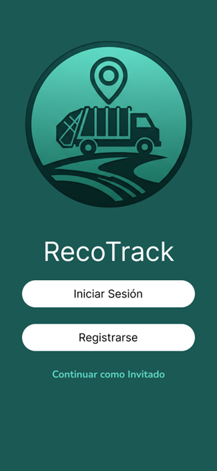
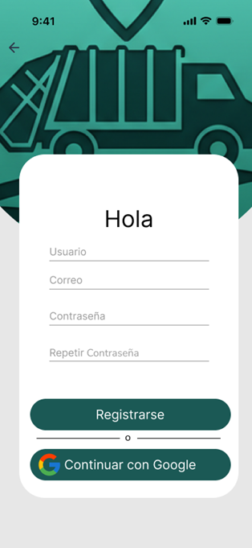
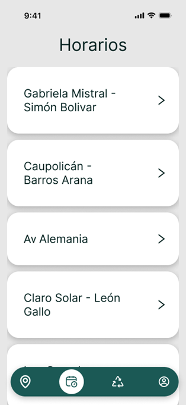
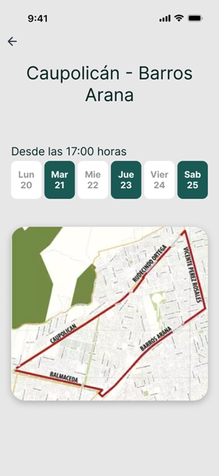
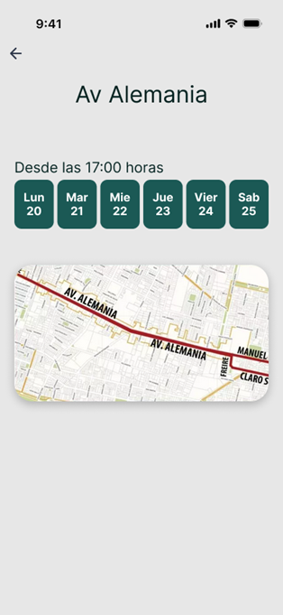
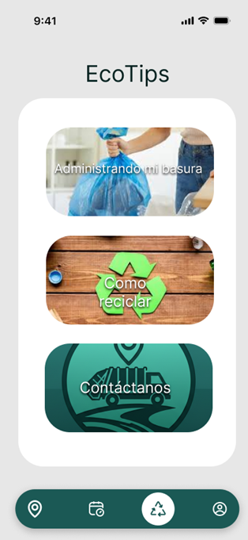
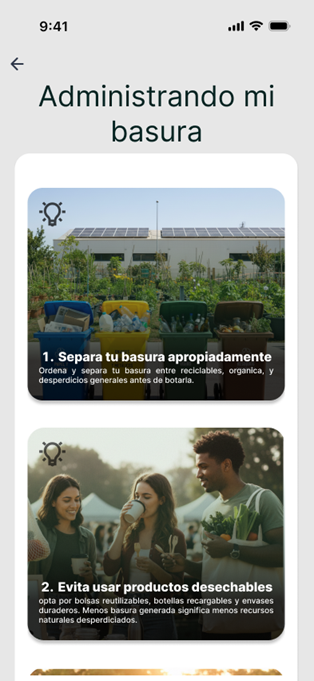
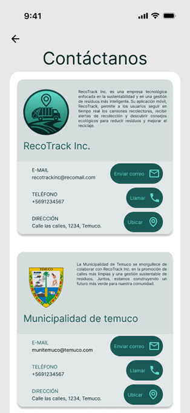

# RecoTrack UXD Project

User Experience Design (UXD) for **RecoTrack**, a mobile application created to provide real-time tracking of garbage collection trucks in Temuco, facilitating access to **schedules**, **smart alerts**, and **recycling points**.

---

## 📖 Index
- [🏁 Introduction](#-introduction)
- [🎯 UX Strategy](#-ux-strategy)
- [👷 Team & Roles](#-team--roles)
- [💡 Research and UX Elements](#-research-and-ux-elements)
- [🧩 Benchmark](#-benchmark)
- [👥 Personas](#-personas)
- [🗺️ Customer Journey](#%EF%B8%8F-customer-journey)
- [🧭 Navigation Flow](#-navigation-flow)
- [📲 Functional Wireframes (Low-Fi)](#-functional-wireframes-low-fi)
- [🔄 Interface Evolution](#-interface-evolution)
- [🎨 High-Fidelity Prototype](#-high-fidelity-prototype)
- [🔗 Resources](#-resources)
- [📜 License](#-license)

---

## 🏁 Introduction

### 1.1. Understanding the Context

In Temuco, garbage collection is scheduled on different days and at specific times across the various sectors of the city. Although information regarding these collection routes is available, it remains limited and does not account for service delays, early arrivals, or other potential disruptions.

As a consequence, residents are often left uncertain about the precise arrival time of collection trucks, which commonly results in two situations:

- Residents place their waste outside too early, leaving it exposed on the streets for extended periods
- Residents fail to put out their waste in time, leading to the accumulation of garbage within their homes

---
### 1.2. Proposed Solution

To address these challenges, we have proposed the development of a mobile application called **RecoTrack**, which enables residents of Temuco to track garbage collection trucks in real time and receive notifications when a truck is approaching their sector. This solution will allow residents to anticipate collection schedules, manage waste disposal more efficiently, and minimize unnecessary accumulation.

#### 📍 Real-Time Route Visualization

- Interactive city map showing garbage truck routes live
- Personalized route display tailored to the user's selected sector
- Integrated schedule details that enables users to anticipate service days and plan waste disposal accordingly

#### 🔔 Smart Notifications for Waste Disposal

- Alerts sent 5, 15, 30, or 60 minutes before truck arrival
- Notifications for garbage truck arrivals, recycling points, and temporary containers
- Reduces waste accumulation and improves collection efficiency
- Requires GPS, location access, and notification permissions

### ♻️ Recycling and Container Integration

- Map includes locations for recycling plastics, glass, batteries, and more
- Map also displays temporary container points requested from the municipality, with availability dates and times
- Route generation and directions to nearest recycling stations or active temporal containers
- Promotes proper waste separation and reduces contamination

### 📡 GPS-Based Truck Tracking

- Mobile GPS devices installed in trucks
- Enables accurate location data and predictive route modeling
- Supports dynamic scheduling and operational optimization

---

## 👷 Team & Roles

| Member | Role |
|---|---|
| **Jorge Quidel** | Project Manager & Presenter |
| **José Alonso** | UX/UI Designer |
| **Agustín Raposo** | UX Research & Analysis |

---

## 🎯 UX Strategy
**Objective:** Enhance the citizen experience with hyperlocal and reliable information.  
**Result:** Prioritized functionalities include a live map, proximity alerts, and a neighborhood-based schedule.

### Value Proposition Canvas
Value Proposition Canvas aligning RecoTrack’s services with user needs, identifying pain relievers, gains, and core benefits such as real-time tracking and improved neighborhood organization.

---

## 💡 Research and UX Elements
| UX Level | Focus | Techniques |
|---|---|---|
| **Strategy** | Needs and objectives | Interviews, observation |
| **Scope** | Requirements | Listing and prioritization |
| **Structure** | IA / Flows | Navigation diagrams |
| **Skeleton** | Interaction / Layout | Low-Fi Wireframes |
| **Surface** | UI | Hi-Fi Prototypes |

---

## 🧩 Benchmark
Benchmark analysis comparing RecoTrack with competitors like Línea Verde, Komtainer, and iRecycle. Highlights differentiating features such as real-time routes, user alerts, and eco-education.

---

## 👥 Personas
User persona representing a homemaker who values cleanliness and organization. Juana symbolizes users managing family routines and seeking reliable waste collection information.

 

User persona representing an independent young professional. Tomás embodies tech-savvy users who balance work and home tasks, needing efficient digital tools for waste management.

 

User persona representing a community leader. Carmen reflects socially active users engaged in neighborhood well-being and environmental awareness.

---

## 🗺️ Customer Journey
Customer Journey Map outlining user interactions across five stages: Awareness, Consideration, Installation, Familiarization, and Daily Use. Emphasizes emotional transitions and app touchpoints.

---

## 🧭 Navigation Flow
App navigation flow showing the main structure of RecoTrack, from login and guest sessions to the core sections such as Home-Map, Calendar, EcoTips, and Community. The flow illustrates user accessibility and logical screen hierarchy.

---

## 📲 Functional Wireframes (Low-Fi)

### 🏠 Home and Authentication
Simple welcome and access through **login**, **register**, or **guest mode**.

  
  
  

### 🗺️ Maps and Location
Real-time map with **route**, **truck position**, and **directions**.

  
  
  

### 🗓️ Calendar
Displays **collection days** by sector.

  
  

### 👤 Profile, Address and Settings
Profile management and **alert/map preferences**.

  
  
  

### 🌱 Ecotips
Environmental education: tips, recycling guides, and contact details.

  
  
  
  

---

## 🔄 Interface Evolution
- Expanded **map area** for better visibility.  
- **Permissions** explained before requesting GPS/Notifications.  
- Added **guest mode** to reduce onboarding friction.  
- **Alert presets** at 5/15/30/60 minutes.  
- **Special pickup** feature included based on community requests.

---

## 🎨 High-Fidelity Prototype

### 🟢 Onboarding and Access
This category presents the initial user flow of RecoTrack, including the welcome, login, and registration screens. It allows users to quickly access the app—either by signing in, creating an account, or entering as guests—ensuring a smooth and intuitive start to the experience.

  
  
  

### 🗺️ Map and Navigation
This category displays the navigation system that guides users to their waste collection or recycling destinations in real time. The interface provides clear directions and estimated arrival times, helping users anticipate when the garbage truck will reach their area. The visual route on the map, along with intuitive icons and prompts, ensures a smooth and practical navigation experience aligned with RecoTrack’s goal of improving urban waste management efficiency.

  
  

### 🕓 Collection Schedules
This category presents the weekly garbage collection schedules organized by neighborhood sectors. Each screen displays the route and the specific collection days for each zone, allowing users to easily check when and where waste pickup will occur. The visual layout combines maps with clear time slots, helping users plan their waste disposal efficiently and stay aligned with their local collection timetable.

  
  
  
  

### 👤 Profile and Configuration
This category showcases the user’s personal profile and customizable settings within RecoTrack. Users can add their address for location-based services, adjust alert preferences, and manage map display options such as showing recycling points or specific truck routes. The clean and intuitive interface allows for a personalized experience, ensuring that notifications and navigation align with each user’s daily routine and environmental goals.

  
  
  

### ♻️ Ecotips
This category focuses on promoting environmental awareness and sustainable habits among users. It includes practical advice on managing household waste, recycling correctly, and reducing disposable product use. Through sections like “How to Recycle” and “Managing My Waste,” users can explore step-by-step eco-friendly practices. Additionally, the “Contact Us” section connects users with RecoTrack and local institutions, reinforcing collaboration toward a cleaner and more sustainable community.

  
  
  
  

---

## 🔗 Resources

Figma Wireframe & Prototype: [RecoTrack](https://www.figma.com/design/LT7WAZXoFXdRK8uyBaTN49/RecoTrack)

---

## 📜 License
**MIT License — 2025 RecoTrack UXD Project**
