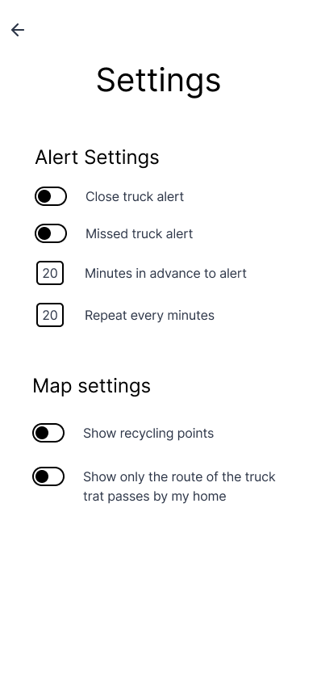

# Proyecto RecoTrack UXD

Diseño de experiencia de usuario (UXD) para **RecoTrack**, una aplicación móvil creada para ofrecer seguimiento en tiempo real de los camiones recolectores en Temuco y facilitar el acceso a **horarios**, **alertas inteligentes** y **puntos de reciclaje**.

---

## 📖 Índice
- [🏁 Introducción](#-introducción)
- [🎯 Estrategia UX](#-estrategia-ux)
- [💡 Investigación y Elementos UX](#-investigación-y-elementos-ux)
- [🧩 Benchmark](#-benchmark)
- [👥 Personas](#-personas)
- [🗺️ Customer Journey](#%EF%B8%8F-customer-journey)
- [🧭 Flujo de Navegación](#-flujo-de-navegación)
- [📲 Wireframes Funcionales (Low‑Fi)](#-wireframes-funcionales-low-fi)
- [🔄 Evolución de Interfaces](#-evolución-de-interfaces)
- [🎨 Alta Fidelidad – Prototipo Final](#-alta-fidelidad--prototipo-final)
- [📜 Licencia](#-licencia)

---

## 🏁 Introducción
La recolección de residuos en Temuco adolece de **falta de información en tiempo real**, lo que produce acumulación de basura e incertidumbre en los hogares. **RecoTrack** entrega visibilidad del recorrido del camión, recordatorios por sector y guía para reciclar.

---

## 🎯 Estrategia UX
**Objetivo:** mejorar la experiencia ciudadana con información hiperlocal y confiable.  
**Resultado:** funcionalidades priorizadas: mapa en vivo, alertas por proximidad y calendario por sector.

### Canvas de Propuesta de Valor

---

## 💡 Investigación y Elementos UX
| Nivel UX | Foco | Técnicas |
|---|---|---|
| **Estrategia** | Necesidades y objetivos | Entrevistas, observación |
| **Alcance** | Requerimientos | Lista y priorización |
| **Estructura** | IA / Flujos | Diagramas de navegación |
| **Esqueleto** | Interacción / Layout | Wireframes Low‑Fi |
| **Superficie** | UI | Prototipos Hi‑Fi |

---

## 🧩 Benchmark

---

## 👥 Personas

 
 

---

## 🗺️ Customer Journey

---

## 🧭 Flujo de Navegación

---

## 📲 Wireframes Funcionales (Low‑Fi)

### 🏠 Inicio y Autenticación
Bienvenida simple y acceso mediante **iniciar sesión**, **registrarse** o **modo invitado**.

  
  
  

### 🗺️ Mapas y Localización
Mapa en tiempo real con **ruta**, **posición del camión** e **indicaciones**.

  
  
  

### 🗓️ Calendario y Domicilio
Consulta de **días de recolección** por sector y administración del **domicilio**.

  
  
  

### 👤 Perfil y Ajustes
Gestión de perfil y **preferencias de alerta/mapa**.

  
  

### 🌱 Ecotips
Educación ambiental: tips, guía para reciclar y contactos.

  
  
  
  

---

## 🔄 Evolución de Interfaces
- Área del **mapa** ampliada por demanda de visibilidad.
- **Permisos** explicados antes de solicitar GPS/Notificaciones.
- **Modo invitado** para reducir fricción inicial.
- **Presets de alerta** 5/15/30/60 min.
- **Retiro especial** agregado por necesidad vecinal.

---

## 🎨 Alta Fidelidad – Prototipo Final

### 🟢 Inicio y Acceso

  
  
  

### 🗺️ Mapa y Navegación

  
  

### 🕓 Horarios de Recolección

  

### 👤 Perfil y Configuración

  
  

### ♻️ Ecotips

  
  

---

## 🔄 Evolución de Interfaces
- Área del **mapa** ampliada por demanda de visibilidad.  
- **Permisos** explicados antes de solicitar GPS/Notificaciones.  
- **Modo invitado** para reducir fricción inicial.  
- **Presets de alerta** 5/15/30/60 min.  
- **Retiro especial** agregado por necesidad vecinal.  

---

## 🎨 Alta Fidelidad – Prototipo Final

### 🟢 Inicio y Acceso

---

### 🗺️ Mapa y Navegación

---

### 🕓 Horarios de Recolección

---

### 👤 Perfil y Configuración

---

### ♻️ Ecotips y Educación Ambiental

---

## 📜 Licencia
**MIT License — 2025 Proyecto RecoTrack UXD**
